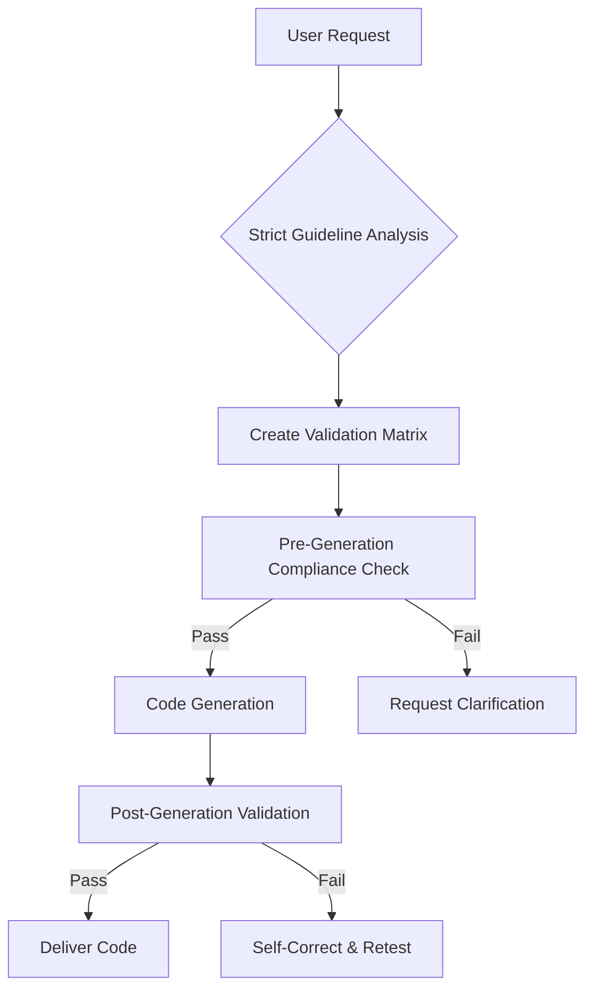
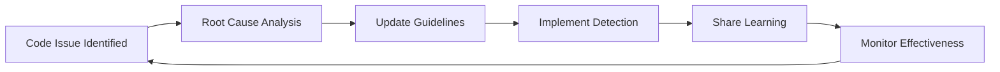

# CLAUDE.md - Ultimate AI Coding Guidelines for Claude Code (v5.0)

## 🚨 TOP 5 NON-NEGOTIABLE RULES - MUST READ FIRST

1. **NEVER REPLACE COMPLEX COMPONENTS WITH SIMPLIFIED VERSIONS** — Always fix the actual problem in existing code, never create a "simplified" replacement.

2. **ALWAYS FIX ROOT CAUSES** — Diagnose and address the underlying issue, don't create workarounds or patches that mask it.

3. **LLM-DIRECTIVE: WHEN REQUIREMENTS ARE AMBIGUOUS, ASK FOR CLARIFICATION** — If any part of the request is unclear, always ask specific questions rather than making assumptions.

4. **CODE MUST EXACTLY MATCH REQUIREMENTS** — Implement precisely what was requested, no extra features, no altered behavior unless explicitly approved.

5. **EVERY FUNCTION MUST HANDLE ERRORS AND EDGE CASES** — No exceptions. All code must validate inputs, handle errors gracefully, and consider edge conditions.

> ⚠️ **Remember: When in doubt, ASK. It's always better to clarify requirements than to make incorrect assumptions.**

---

## 📋 HOW TO USE THIS DOCUMENT

This is a modular coding standard for AI-assisted development. The document follows this structure:

1. **Core Modules (#1-5)**: Essential for all coding tasks, contain the most critical guidelines
2. **Extended Modules (#6-12)**: Applied based on specific project needs (security, testing, etc.)
3. **Process Modules (#13-18)**: Cover workflows, reviews, and improvement processes

**For Claude**: The entire document is automatically loaded when referenced. You can link to specific sections using anchors (#section-name).

**For Ollama or Smaller Models**: Import only the Core Modules plus any specific Extended or Process modules needed for your task to avoid context window limitations.

### OLLAMA CORE PROMPT (Condensed Version of Core Guidelines)

```
CLAUDE.md CORE DIRECTIVES (v5.0):
1. NEVER create simplified alternatives to complex code - fix the actual implementation
2. Find and fix ROOT CAUSES of issues, not symptoms
3. If requirements are ambiguous, ASK FOR CLARIFICATION immediately
4. Match requirements EXACTLY - no extras, no alterations
5. ALL code must handle errors, edge cases, and validate inputs
6. Write enterprise-grade code: robust, maintainable, secure, well-tested
7. Follow existing patterns, naming conventions, and architecture
8. Add explicit types, fix ALL linting errors immediately
9. Test thoroughly - aim for ≥80% coverage
10. Document code clearly - explain WHY, not just WHAT

For detailed guidelines on specific areas:
- Security: See Section 7
- Testing: See Section 6
- Database: See Section 8
- Accessibility: See Section 9
- Internationalization: See Section 10
- Environment/Config: See Section 11
- Monitoring: See Section 12
- Git Workflow: See Section 14

When in doubt, ASK for clarification rather than making assumptions.
```

---

## 🚦 ENFORCEMENT MECHANISM

**Before any code generation occurs:**

1. Parse and validate all requirements against this document
2. Create validation checklist matching requirements to guidelines
3. Generate code only after full checklist compliance verification
4. Post-generation validation against all quality gates



## 🔍 AUTOMATED GUARDRAILS

```typescript
interface CodeGuardrails {
  allowMockData: false;
  allowWorkarounds: false;
  allowSimplification: false;
  requireRootCauseAnalysis: true;
  enforceEnterpriseStandards: true;
  validationTimeout: 30000; // ms
}
```

**Quality Gates (Blocking Criteria):**

- [ ] Zero linting/compilation errors (blocking)
- [ ] 100% requirement coverage verification
- [ ] Static analysis security scan (SAST) clean
- [ ] Code complexity metrics within thresholds:
  - Cyclomatic complexity ≤ 15
  - Cognitive complexity ≤ 25
  - Halstead difficulty ≤ 25
- [ ] ≥80% unit-test coverage for new logic
- [ ] No hardcoded secrets or sensitive data
- [ ] All acceptance criteria met
- [ ] Security vulnerabilities addressed

---

## 1. FOUNDATIONAL PRINCIPLES

### 1.1 Enterprise-Grade Mindset

**Default to enterprise-worthy solutions.** This means:

- Prioritize stability, robustness, security, and maintainability
- Comprehensive error handling is a core requirement, not optional
- Follow established software engineering best practices

### 1.2 Clarity and Simplicity

- **KISS**: Keep It Simple, Stupid - prioritize the simplest solution that effectively solves the problem
- **DRY**: Don't Repeat Yourself - eliminate redundant code through reusable abstractions
- **YAGNI**: You Ain't Gonna Need It - implement only what's explicitly requested
- **Readability**: Code should be written for humans to read and understand

### 1.3 Correctness

- **Accuracy**: Code must correctly implement requirements and produce expected output
- **Completeness**: Implement all specified requirements, no more and no less
- **Consistency**: Maintain consistent behavior across similar operations
- **Security**: Follow secure coding practices, sanitize inputs, validate outputs

> ⚠️ **If requirements are unclear or ambiguous, STOP and ask for clarification rather than making assumptions.**

### 1.4 Maintainability and Scalability

- **Modularity**: Break down complex systems into smaller, independent modules with clear interfaces
- **Loose Coupling**: Minimize dependencies between modules
- **High Cohesion**: Elements within a module should be closely related and focused on a single purpose
- **Extensibility**: Design code to allow for future enhancements with minimal effort
- **Testability**: Write code that's easy to test with small, focused functions and dependency injection

### 1.5 Efficiency Considerations

- **Profile Before Optimizing**: Only optimize after identifying performance bottlenecks
- **Algorithmic Efficiency**: Choose appropriate data structures and algorithms (consider Big O complexity)
- **Resource Management**: Ensure efficient use of resources (CPU, memory, network, disk I/O)
- **Balance**: Find the right balance between performance and maintainability

---

## 2. ROBUSTNESS & ERROR HANDLING

### 2.1 Comprehensive Error Handling Strategy

> ⚠️ **LLM-DIRECTIVE: Error handling is not optional. Every function must have appropriate error handling.**

#### 2.1.1 Input Validation

- **ALWAYS validate all function inputs** at the start of each function
- Use strong typing and schema validation where possible
- Validate not just type but also value ranges, formats, and business rules
- Be explicit about required vs. optional parameters
- For REST APIs, validate query parameters, path parameters, headers, and body

#### 2.1.2 Error Handling Patterns

- **Use try/catch blocks** for operations that may fail
- Create specific error types/subclasses for different error categories
- Provide meaningful error messages that aid debugging
- Include context information in errors (parameters, state, operation)
- Handle errors at the appropriate level, don't just propagate all errors to the top level

#### 2.1.3 Graceful Degradation

- Design for partial system failure (some components may be down)
- Implement fallbacks and safe defaults when possible
- Include retry logic with exponential backoff for transient failures
- Log errors for monitoring but don't expose sensitive information to users
- Alert on critical errors but silence or aggregate non-critical ones

#### 2.1.4 Resource Management

- Use language-specific patterns to ensure resource cleanup (finally blocks, context managers, RAII)
- Close all resources (files, connections, streams) in finally blocks
- Use connection pooling for database and external service connections
- Implement timeouts for all external calls
- Handle resource exhaustion gracefully (memory, disk space, network)

> ⚠️ **If you're unsure how to handle a specific error case, ASK for clarification rather than implementing an incomplete solution.**

### 2.2 Implementation Example

```javascript
// Example of comprehensive error handling
function processUserData(userData) {
  // Input validation
  if (!userData || typeof userData !== 'object') {
    throw new ValidationError('Invalid user data provided');
  }

  try {
    // Validate required fields
    validateRequiredFields(userData);

    // Process data with external service
    const result = await externalService.process(userData);

    // Validate result
    if (!isValidResult(result)) {
      throw new ProcessingError('Invalid result received');
    }

    return result;
  } catch (error) {
    if (error instanceof NetworkError) {
      // Handle network issues
      logError('Network error during processing', error);
      return retryOrFallback();
    } else if (error instanceof ValidationError) {
      // Handle validation issues
      logError('Validation error', error);
      return safeDefaultValue();
    } else {
      // Handle unexpected errors
      logError('Unexpected error', error);
      throw new AppError('Processing failed', { cause: error });
    }
  } finally {
    // Always clean up resources
    releaseResources();
  }
}
```

---

## 3. CODE GENERATION PROTOCOL

### 3.1 Requirement Decomposition

```python
def validate_requirements(request):
    # Atomic decomposition
    requirements = strict_decompose(request)
    for req in requirements:
        if not has_implementation_path(req):
            raise ClarificationNeeded(req)
        if conflicts_with_guidelines(req):
            raise ComplianceError(req)
    return safety_wrapped(requirements)
```

### 3.2 Understanding and Clarification

- **Active Listening**: Before generating code, ensure complete understanding of requirements
- **Scope Definition**: Clearly define what is included and excluded from the task
- **Constraint Awareness**: Identify and adhere to all constraints (language, framework, performance)
- **LLM-DIRECTIVE: Ask questions immediately** if any part of the request is ambiguous

> ⚠️ **When faced with unclear requirements, always seek clarification. It's better to ask questions than to make incorrect assumptions.**

### 3.3 Avoiding Hallucinations and Sidesteps

- **LLM-DIRECTIVE: Base code generation on established practices and official documentation**
- **Stick to the Request**: Focus solely on fulfilling the user's explicit request
- **Verify External Information**: Confirm currency and correctness of external knowledge
- **LLM-DIRECTIVE: Admit limitations** clearly when a request is beyond capabilities or information available

### 3.4 Structured Code Generation Process

- **Incremental Generation**: Break complex tasks into smaller, manageable steps
- **Contextual Awareness**: Maintain awareness of existing codebase and patterns
- **Dependency Management**: Clearly state and justify any new dependencies
- **Platform/Environment Considerations**: Be mindful of target platform and environment

### 3.5 Code Style and Documentation

- **Consistency**: Adhere to a consistent coding style
- **Meaningful Naming**: Use descriptive, unambiguous names
- **Comments**: Explain "why," not "what" - document intent and complex logic
- **Docstrings/API Documentation**: Provide clear documentation for functions, classes, and modules
- **Self-Documenting Code**: Write code that is as self-explanatory as possible

---

## 4. TECHNOLOGY-SPECIFIC RULES

### 4.1 TypeScript and Linting

- **ALWAYS add explicit types** to all function parameters, variables, and return types
- **ALWAYS run appropriate linter** (e.g., `pnpm build`) before considering code complete
- Fix all linter and TypeScript errors immediately - don't leave them for the user
- When making changes to multiple files, check each one for type errors

### 4.2 Prisma Usage

- **NEVER use raw SQL queries** (`$queryRaw`, `$queryRawUnsafe`) - always use Prisma Client methods
- When relations don't exist in schema, use separate queries with `findMany()` and create lookup maps
- Always check the Prisma schema before assuming relations exist

### 4.3 MUI Component Guidelines

- **ALWAYS check MUI X v8 AND MUI v7 DOCS** before making changes - they have breaking changes
- Verify component APIs and props in the latest documentation
- Handle version-specific breaking changes explicitly

### 4.4 Framework-Specific Conventions

- Follow idiomatic patterns for the chosen language/framework
- Respect framework conventions, directory structures, and recommended practices
- Use framework-specific error handling and logging mechanisms

---

## 5. SELF-CORRECTION AND REVIEW LOOP

### 5.1 Requirements Check

- Re-read the original request and verify that your code fully satisfies it
- Check for any missing, incomplete, or incorrectly implemented aspects
- Verify that the solution aligns with enterprise-grade standards
- Confirm all edge cases are handled

> ⚠️ **If you identify any ambiguities during review, pause and seek clarification rather than proceeding with assumptions.**

### 5.2 No Existing Code Broken

- If modifying existing code, ensure no regressions
- Consider dependencies - what relies on the modified section?
- Verify compatibility with existing codebase

### 5.3 Minimal Necessary Changes

- Verify all changes were absolutely necessary
- Avoid refactoring unrelated code unless explicitly requested

### 5.4 Code Quality Review

- Is the code clean, readable, and well-formatted?
- Does it follow DRY, KISS, YAGNI principles?
- Are there any code smells?
- Is the architecture consistent with project patterns?

### 5.5 Security Review

- Check for common vulnerabilities (injection, XSS, etc.)
- Ensure inputs are validated and outputs are sanitized
- Follow principle of least privilege

### 5.6 Multi-Stage Validation Process

**Implement a two-agent approach for validation:**

1. First agent generates code according to requirements
2. Second agent reviews for compliance with standards, security, and completeness
3. Review findings are used to refine the implementation
4. Process repeats until all validation checks pass

```python
def multi_stage_validation(requirements):
    # First agent generates code
    code = coding_agent.generate(requirements)

    # Second agent reviews
    review = review_agent.validate(code, requirements, standards)

    while not review.passed:
        # Apply corrections based on review
        code = coding_agent.refine(code, review.issues)

        # Re-validate
        review = review_agent.validate(code, requirements, standards)

    return code
```

---

## 6. COMPREHENSIVE TESTING STRATEGY

### 6.1 Testing Philosophy and Approach

- **Test Early, Test Often**: Integrate testing throughout the development lifecycle
- **Balanced Approach**: Use a mix of test types based on the Testing Pyramid or Trophy:
  - **Testing Pyramid**: Many unit tests, fewer integration tests, fewest E2E tests
  - **Testing Trophy**: Static analysis at base, focus on integration tests, with unit tests and minimal E2E tests
- **Automate Everything Possible**: Automate repetitive tests for consistency and speed
- **Tests as Documentation**: Well-written tests serve as living documentation of code behavior

### 6.2 Unit Testing

- **Scope and Granularity**: Test the smallest units of code (functions, methods, classes) in isolation
- **Mocking/Stubbing**: Use mocks and stubs to isolate units from external dependencies
- **Code Coverage Targets**: Aim for high coverage (80-90%+) for critical business logic
- **Fast Execution**: Unit tests should be quick to run frequently during development
- **FIRST Principles**: Tests should be Fast, Independent, Repeatable, Self-Validating, and Thorough

### 6.3 Integration Testing

- **Scope**: Verify interactions between multiple components or services
- **Real Dependencies**: Use real instances where feasible (test databases, service instances)
- **Data Setup and Teardown**: Implement reliable test data management
- **Contract Testing**: For microservices, use contract testing (e.g., Pact) to ensure service compatibility

### 6.4 End-to-End (E2E) Testing

- **User Flow Coverage**: Simulate real user scenarios through the entire application
- **Selector Strategy**: Use stable, resilient selectors for UI elements (e.g., data-testid attributes)
- **Test Data Management**: Carefully manage test data and state
- **Limited Scope**: Use E2E tests selectively for critical flows due to their fragility and slowness

### 6.5 Performance Testing

- **Types**: Include load testing, stress testing, and endurance/soak testing
- **Key Metrics**: Monitor response times, throughput, error rates, and resource utilization
- **Baseline and Regression**: Establish performance baselines and test regularly to detect regressions

### 6.6 Security Testing

- **SAST Integration**: Incorporate static application security testing in the CI pipeline
- **DAST Implementation**: Set up dynamic application security testing for deployed applications
- **Vulnerability Management**: Establish process for prioritizing and remediating discovered issues
- **Regular Security Testing**: Schedule periodic security assessments

### 6.7 Test Automation in CI/CD

- **Pipeline Integration**: Integrate all test types at appropriate stages in the CI/CD pipeline
- **Quality Gates**: Establish test-based quality gates that must be passed to proceed
- **Parallel Execution**: Configure tests to run in parallel to reduce pipeline time
- **Test Results Reporting**: Implement clear reporting of test results and failures

---

## 7. SECURITY REQUIREMENTS

### 7.1 Authentication & Authorization

- **Strong Passwords**: Enforce secure password policies (length, complexity)
- **Multi-Factor Authentication**: Implement MFA for privileged accounts
- **Secure Session Management**: Use HttpOnly, SameSite, and Secure cookies; implement timeouts
- **OAuth/OIDC**: Use standard protocols for authentication when appropriate
- **Role-Based Access Control**: Implement proper permission checks using RBAC or ABAC
- **Least Privilege**: Grant only minimum permissions necessary to perform tasks

### 7.2 Input Validation & Output Encoding

- **Validate All Inputs**: Using allowlists rather than blocklists
- **Context-Appropriate Encoding**: Encode output for its intended context (HTML, SQL, etc.)
- **Parameterized Queries**: Use prepared statements to prevent SQL injection
- **API Input Validation**: Validate all API parameters and payloads

### 7.3 Data Protection

- **Encryption in Transit**: Use TLS/SSL for all external communication
- **Encryption at Rest**: Encrypt sensitive stored data using strong algorithms
- **Data Minimization**: Collect and store only necessary data
- **Secure Deletion**: Implement secure methods for deleting sensitive data

### 7.4 Dependency Security

- **Vulnerability Scanning**: Regularly scan for known vulnerabilities
- **Dependency Updates**: Keep dependencies up-to-date, especially for security patches
- **Trusted Sources**: Use dependencies only from verified sources
- **Minimize Dependencies**: Reduce attack surface by limiting third-party code

### 7.5 Secure Development Lifecycle

- **Threat Modeling**: Identify potential threats early in design phase
- **Security Training**: Keep up with secure coding practices
- **SAST/DAST Integration**: Implement automated security testing
- **Penetration Testing**: Conduct regular security assessments

---

## 8. DATABASE & DATA MANAGEMENT

### 8.1 Data Modeling Principles

- **Normalization**: Aim for normalized data structures (3NF) with strategic denormalization
- **Clarity and Simplicity**: Design schemas that reflect the domain clearly
- **Data Integrity**: Utilize constraints (PRIMARY KEY, FOREIGN KEY, UNIQUE, NOT NULL)
- **Naming Conventions**: Use consistent, clear naming for database objects
- **Appropriate Data Types**: Choose the most efficient types for each column
- **Indexing Strategy**: Design indexes thoughtfully for optimal query performance

### 8.2 Query Optimization Standards

- **Efficient Queries**: Write performant and scalable database queries
- **SELECT Specific Columns**: Avoid SELECT \* and retrieve only needed data
- **SARGable WHERE Clauses**: Ensure conditions can use indexes effectively
- **JOIN Optimization**: Use appropriate JOIN types on indexed columns
- **Avoid N+1 Problems**: Use eager loading or batching to prevent excessive queries
- **Query Analysis**: Use EXPLAIN to understand and optimize execution plans

### 8.3 Migration Procedures

- **Version Control**: Use database migration tools for schema versioning
- **Atomic Migrations**: Ensure migrations either fully succeed or rollback
- **Backward Compatibility**: Design migrations for zero-downtime deployment
- **Data Migration**: Handle large data migrations carefully with batching
- **Testing**: Thoroughly test migrations before production deployment
- **Rollback Plan**: Always prepare a documented rollback procedure

### 8.4 Connection Management

- **Connection Pooling**: Configure optimal pool size based on workload
- **Resource Release**: Always close connections properly in finally blocks
- **Timeouts**: Set appropriate connection and query timeouts
- **Retry Mechanisms**: Implement retries with backoff for transient failures

### 8.5 Data Security and Privacy

- **Least Privilege**: Grant minimal necessary database permissions
- **Encryption**: Protect sensitive data at rest and in transit
- **Audit Logging**: Track and log sensitive operations
- **Data Masking**: Use anonymization for non-production environments
- **Compliance**: Adhere to relevant data protection regulations

---

## 9. ACCESSIBILITY STANDARDS (A11Y)

> ⚠️ **LLM-DIRECTIVE: Focus on implementing key accessibility patterns and high-level compliance; raise concerns if detailed a11y review is needed.**

### 9.1 WCAG Compliance

- **Target Level**: Aim for WCAG 2.1 Level AA compliance as minimum
- **POUR Principles**: Ensure content is Perceivable, Operable, Understandable, Robust
- **Latest Standards**: Stay current with WCAG 2.2 requirements (focus appearance, dragging alternatives)

### 9.2 Semantic HTML

- **Proper Element Usage**: Use elements for their intended purpose (<nav>, <button>, etc.)
- **Logical Structure**: Create clear heading hierarchy (h1-h6) without skipping levels
- **Landmarks**: Use HTML5 semantic elements to define regions of a page

### 9.3 Keyboard Navigation

- **Full Keyboard Access**: Ensure all functionality works with keyboard alone
- **Logical Tab Order**: Create intuitive focus sequence through the interface
- **Visible Focus Indicators**: Provide clear visual indication of focused elements
- **Skip Links**: Implement "skip to main content" for keyboard users

### 9.4 ARIA Usage

- **Use Sparingly**: Only apply ARIA when semantic HTML is insufficient
- **Correct Implementation**: Follow WAI-ARIA specification and patterns
- **Live Regions**: Announce dynamic content changes appropriately
- **Widget Patterns**: Follow established ARIA design patterns for custom components

### 9.5 Component-Specific Guidelines

- **Forms**: Associate labels with controls, group related fields, provide clear errors
- **Images**: Use descriptive alt text for informative images, empty alt for decorative ones
- **Tables**: Use proper structure with captions, headers, and appropriate scope attributes
- **Multimedia**: Provide captions, transcripts, and audio descriptions
- **Color Contrast**: Ensure sufficient contrast and don't rely on color alone

### 9.6 Testing for Accessibility

- **Automated Testing**: Use tools like Axe, Lighthouse, WAVE for basic checks
- **Manual Keyboard Testing**: Verify navigation without mouse
- **Screen Reader Testing**: Test with common assistive technologies
- **User Testing**: Involve users with disabilities when possible
- **Regular Audits**: Conduct periodic accessibility reviews

---

## 10. INTERNATIONALIZATION (I18N) & LOCALIZATION (L10N)

> ⚠️ **LLM-DIRECTIVE: Focus on fundamental i18n/l10n architecture and patterns; implement best practices while maintaining code clarity.**

### 10.1 Text Externalization

- **No Hardcoded Strings**: Externalize all user-facing text into resource files
- **i18n Libraries**: Use established frameworks for managing translations
- **Meaningful Keys**: Create consistent, descriptive keys for translatable content
- **Context for Translators**: Provide notes about string usage and meaning

### 10.2 Locale-Specific Formatting

- **Dates, Times, Numbers**: Use locale-aware formatting functions
- **Addresses and Phone Numbers**: Accommodate varying international formats
- **Sorting and Collation**: Apply locale-sensitive sorting algorithms

### 10.3 Right-to-Left (RTL) Support

- **Layout Considerations**: Design layouts that can flip correctly for RTL languages
- **Logical CSS Properties**: Use margin-inline-start instead of margin-left, etc.
- **Text Direction**: Set dir="rtl" attribute where appropriate
- **Directional Icons**: Ensure visual elements adapt to text direction

### 10.4 Pluralization and Gender

- **Plural Rules**: Support language-specific pluralization patterns
- **Gender Agreement**: Provide mechanisms for grammatical gender handling

### 10.5 Testing Localization

- **Pseudo-Localization**: Test with modified strings to catch i18n issues early
- **Real Translations**: Verify with actual translated content
- **RTL Testing**: Specifically test right-to-left language support
- **Native Review**: Have translations reviewed by fluent speakers

---

## 11. ENVIRONMENT & CONFIGURATION

### 11.1 Environment Variables

- **Source of Truth**: Use environment variables for configuration across environments
- **Naming Convention**: Follow consistent pattern (UPPER_SNAKE_CASE with prefixes)
- **No Hardcoding**: Never embed environment-specific values in code
- **Documentation**: Document all variables with purpose and example values

### 11.2 Secrets Management

- **Secure Storage**: Use dedicated tools (HashiCorp Vault, AWS Secrets Manager)
- **No VCS Storage**: Never commit secrets to version control
- **Access Control**: Implement least privilege for secrets access
- **Rotation**: Support regular credential rotation
- **Runtime Injection**: Add secrets at runtime, not build time

### 11.3 Configuration Files

- **Format**: Use standard formats (YAML, JSON, TOML)
- **Validation**: Verify configuration at startup and fail fast if invalid
- **Hierarchy**: Implement clear precedence rules for configuration sources
- **Defaults**: Provide sensible defaults where appropriate

### 11.4 Environment Consistency

- **Dev/Prod Parity**: Minimize differences between environments
- **Infrastructure as Code**: Use IaC tools for consistent provisioning
- **Container-Based**: Consider containerization for environment consistency

---

## 12. MONITORING & OBSERVABILITY

### 12.1 Logging Strategy

- **Standard Levels**: Use consistent logging levels (DEBUG, INFO, WARN, ERROR)
- **Configurable**: Allow log level adjustment per environment
- **Context-Rich**: Include timestamps, correlation IDs, and relevant metadata
- **PII Protection**: Never log sensitive personal data

### 12.2 Structured Logging

- **JSON Format**: Use structured formats for better analysis
- **Consistent Fields**: Define standard fields for all log entries
- **Tool Integration**: Ensure compatibility with log aggregation systems

### 12.3 Error Tracking

- **Centralized System**: Integrate with error monitoring services
- **Alert Configuration**: Set up notifications for critical issues
- **Deduplication**: Group similar errors for easier management
- **Context Preservation**: Capture stack traces and relevant state

### 12.4 Performance Monitoring

- **APM Integration**: Use Application Performance Monitoring tools
- **Key Metrics**: Track response times, throughput, error rates
- **Resource Monitoring**: Watch CPU, memory, disk, and network usage
- **Distributed Tracing**: Implement for microservice architectures

### 12.5 Health Checks

- **Endpoints**: Create /health and /readiness endpoints
- **Comprehensive Checks**: Verify all critical dependencies
- **Kubernetes Integration**: Support liveness, readiness, and startup probes
- **Monitoring Integration**: Connect health checks to alerting systems

---

## 13. CODE REVIEW PROCESS

### 13.1 Code Review - Execute Top to Bottom

Use the following instructions from top to bottom to execute a Code Review.

#### Create a TODO with EXACTLY these 6 Items

1. Analyze the Scope given
2. Find code changes within Scope
3. Find relevant Specification and Documentation
4. Compare code changes against Documentation and Requirements
5. Analyze possible differences
6. Provide PASS/FAIL verdict with details

Follow step by step and adhere closely to the following instructions for each step.

#### DETAILS on every TODO item

##### 1. Analyze the Scope given

check: <$ARGUMENTS>

If empty, use default, otherwise interpret <$ARGUMENTS> to identify the scope of the Review.

##### 2. Find code changes within Scope

With the identified Scope use `git diff` (on default: `git diff HEAD~1`) to find code changes.

##### 3. Find relevant Specifications and Documentation

- FIND the Task, Sprint and Milestone involved in the work that was done and output your findings.
- IDENTIFY the project documentation in .simone/ folder and FIND ALL related REQUIREMENTS there
- READ involved Documents especially in .simone/01_PROJECT_DOCS and .simone/02_REQUIREMENTS

##### 4. Compare code changes against Documentation and Requirements

- Use DEEP THINKING to compare changes against found Requirements and Specs.
- Compare especially these things:
  - **Data models / schemas** — fields, types, constraints, relationships.
  - **APIs / interfaces** — endpoints, params, return shapes, status codes, errors.
  - **Config / environment** — keys, defaults, required/optional.
  - **Behaviour** — business rules, side-effects, error handling.
  - **Quality** — naming, formatting, tests, linter status.

**IMPORTANT**:

- Deviations from the Specs is not allowed. Not even small ones. Be very picky here!
- If in doubt call a **FAIL** and ask the User.
- Zero tolerance on not following the Specs and Documentation.

##### 5. Analyze the differences

- Analyze any difference found
- Give every issue a Severity Score
- Severity ranges from 1 (low) to 10 (high)
- Remember List of issues and Scores for output

##### 6. Provide PASS/FAIL verdict with details

- Call a **FAIL** on any differences found.
  - Zero Tolerance - even on well meant additions.
  - Leave it on the user to decide if small changes are allowed.
- Only **PASS** if no discrepancy appeared.

#### IMPORTANT: Output Format

In this very particular Order:

- Result: **FAIL/PASS** Your final decision on if it's a PASS or a FAIL.
- **Scope:** Inform the user about the review scope.
- **Findings** Detailed list with all Issues found and Severity Score.
- **Summary** Short summary on what is wrong or not.
- **Recommendation** Your personal recommendation on further steps.

---

## 14. GIT WORKFLOW & CONTRIBUTION

### 14.1 Branching Strategy

- **Standardized Approach**: Follow established patterns (GitFlow, GitHub Flow, Trunk-Based)
- **Main/Master Protection**: No direct commits to production branches
- **Feature Branches**: Create for new features or non-trivial fixes
- **Release Branches**: Use for preparing production releases (GitFlow)
- **Hotfix Process**: Implement for urgent production fixes

### 14.2 Branch Naming

- **Clarity and Consistency**: Use descriptive, standardized names
- **Format**: feature/TICKET-ID-short-description, bugfix/TICKET-ID-description
- **Lowercase and Hyphens**: Avoid spaces or special characters

### 14.3 Commit Messages

- **Conventional Commits**: Use format: type(scope): description
- **Imperative Mood**: Start with verb in present tense
- **Concise Subject**: Keep under 50-72 characters
- **Detailed Body**: Explain why and what (optional)
- **Issue References**: Include ticket numbers (Closes #123)

### 14.4 Pull Request Process

- **Clear Description**: Summarize changes and link issues
- **Small, Focused PRs**: Keep changes atomic and reviewable
- **CI Compliance**: Ensure automated checks pass
- **Review Process**: Assign appropriate reviewers
- **Feedback Loop**: Address all review comments
- **Branch Cleanup**: Delete branches after merging

### 14.5 Code Review Standards

- **Constructive Approach**: Be respectful and focus on the code
- **Thoroughness**: Review for correctness, style, security, performance
- **Timeliness**: Complete reviews promptly
- **Clarity**: Provide clear explanations for suggested changes
- **Approval Process**: Explicitly approve or request changes

---

## 15. FINAL VALIDATION CHECKLIST

Before any code delivery, **MUST** verify:

1. [ ] Strict requirement-to-code traceability
2. [ ] Zero guideline violations per static analysis
3. [ ] All security controls properly implemented
4. [ ] Complete error handling with rollback
5. [ ] Performance baseline maintained
6. [ ] No existing functionality regressions
7. [ ] Full documentation updated
8. [ ] Test suite expanded/updated
9. [ ] Architectural consistency preserved
10. [ ] Compliance with all industry standards

---

## 16. COMMON ANTI-PATTERNS TO AVOID

### What NOT to do:

- Don't create simplified versions of complex existing components
- Don't use raw SQL when ORM methods exist
- Don't ignore linting errors
- Don't hardcode configuration values
- Don't skip error handling
- Don't leave TODO comments in production code
- Don't bypass existing architecture patterns
- Don't make assumptions about requirements
- Don't generate code that ignores edge cases
- Don't insert large blocks of code from external sources without proper attribution

### What TO do instead:

- Fix and improve existing complex implementations
- Use proper ORM methods and patterns
- Address all linting and type errors immediately
- Use environment variables and configuration systems
- Implement comprehensive error handling
- Complete all implementation before submission
- Follow established architectural patterns
- Ask questions when requirements are unclear
- Consider and handle edge cases explicitly
- Generate original code or properly attribute sources

---

## 17. WHEN IN DOUBT

> ⚠️ **CRITICAL REMINDER: When faced with ambiguity, ALWAYS ask for clarification rather than proceeding with assumptions.**

If uncertain about any aspect of implementation:

1. **ASK** - Don't assume, ask for clarification
2. **RESEARCH** - Check documentation and best practices
3. **TEST** - Verify functionality thoroughly
4. **DOCUMENT** - Explain decisions and approaches
5. **REVIEW** - Use the checklist above

Remember: It's better to ask questions and deliver quality code than to make assumptions and create problems.

Specific scenarios when you MUST ask:

- Requirements are vague or contradictory
- You don't understand a domain-specific term
- Multiple implementation paths exist with different trade-offs
- The technical complexity exceeds what can be reasonably implemented in a single step
- You're uncertain how to handle edge cases or error scenarios

---

## 18. CONTINUOUS IMPROVEMENT PROCESS

This document is a living standard that evolves based on experience and feedback:

1. **Track Issues:** Monitor code quality issues that slip through
2. **Analyze Patterns:** Identify recurring problems or gaps in guidelines
3. **Update Standards:** Regularly refine this document to address discovered issues
4. **Validate Changes:** Test guideline changes for effectiveness
5. **Share Knowledge:** Disseminate updates to all stakeholders

When significant issues are identified in production:

- Add specific rules to prevent similar issues
- Create example patterns of both correct and incorrect implementations
- Update validation tools to catch the specific issue type



---

## ⚠️ FINAL REMINDER

This document represents the minimum standards for code quality. Every piece of code should meet these requirements. When in doubt, err on the side of robustness, security, and maintainability. Enterprise-grade solutions are not optional - they are the baseline expectation.

Code generation and review are collaborative processes. The guidelines exist to ensure consistent, high-quality outcomes, not to replace human judgment. Always prioritize effective solutions that fulfill business requirements over rigid adherence to any single rule.

> ⚠️ **If requirements are unclear or incomplete, ALWAYS ask for clarification rather than making assumptions.**

**Last reviewed: May 2025 - Feedback or suggestions: submit a PR at https://github.com/your-org/claude-guidelines or email guidelines@your-org.com**
