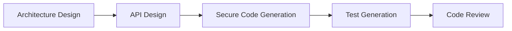
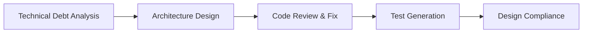
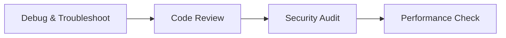
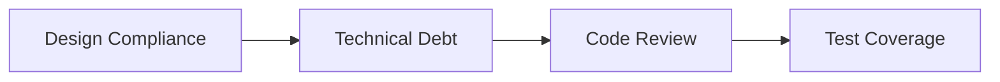

# Prompt Engineering Guidelines

## Overview

This guide provides best practices for writing effective prompts for Claude and other AI models, including how to chain prompts for complex workflows.

## 🎯 Choosing the Right Prompt

### A. **Starting Something New** 
- **Building a new feature/app** → Use [`03-architecture-design.md`](03-architecture-design.md)
- **Creating an API** → Use [`06-api-design.md`](06-api-design.md)
- **Writing secure code** → Use [`01-secure-code-generation.md`](01-secure-code-generation.md)

### B. **Improving Existing Code**
- **Finding and fixing bugs** → Use [`07-debug-troubleshooting.md`](07-debug-troubleshooting.md)
- **Code review & quality** → Use [`02-code-review-autofix.md`](02-code-review-autofix.md)
- **Technical debt assessment** → Use [`08-technical-debt-analysis.md`](08-technical-debt-analysis.md)

### C. **Verification & Testing**
- **Writing tests** → Use [`04-test-generation.md`](04-test-generation.md)
- **Checking design compliance** → Use [`05-design-compliance-analysis.md`](05-design-compliance-analysis.md)

---

## 🔗 Prompt Chaining Strategies

### 🏗️ **For New Feature Development**

**Steps:**
1. Start with `03-architecture-design.md` to plan the system
2. Use `06-api-design.md` to define interfaces
3. Implement with `01-secure-code-generation.md`
4. Add tests using `04-test-generation.md`
5. Verify quality with `02-code-review-autofix.md`

### 🔧 **For Legacy Code Modernization**

**Steps:**
1. Assess current state with `08-technical-debt-analysis.md`
2. Plan improvements with `03-architecture-design.md`
3. Fix issues using `02-code-review-autofix.md`
4. Add missing tests with `04-test-generation.md`
5. Verify compliance using `05-design-compliance-analysis.md`

### 🐛 **For Debugging Production Issues**

**Steps:**
1. Find root cause with `07-debug-troubleshooting.md`
2. Review related code with `02-code-review-autofix.md`
3. Check for security issues (use security sections in review)
4. Verify performance impact

### 📋 **For Compliance & Auditing**

**Steps:**
1. Check implementation vs design with `05-design-compliance-analysis.md`
2. Assess technical debt with `08-technical-debt-analysis.md`
3. Review code quality with `02-code-review-autofix.md`
4. Ensure test coverage with `04-test-generation.md`

---

## 💡 Prompt Writing Examples

### Example 1: "I need to build a user authentication system"
```bash
1. Use: 03-architecture-design.md
   Input: "Design a secure user authentication system with OAuth2, MFA, and session management"
   
2. Then: 06-api-design.md
   Input: "Create REST API for the authentication system designed above"
   
3. Then: 01-secure-code-generation.md
   Input: "Implement the authentication API with Node.js and PostgreSQL"
   
4. Finally: 04-test-generation.md
   Input: "Write comprehensive tests for the authentication system"
```

### Example 2: "My app is slow and buggy"
```bash
1. Use: 07-debug-troubleshooting.md
   Input: "Debug slow API response times and intermittent 500 errors"
   
2. Then: 02-code-review-autofix.md
   Input: "Review and fix performance issues in the API codebase"
   
3. Then: 08-technical-debt-analysis.md
   Input: "Analyze technical debt contributing to performance problems"
```

---

## 🚀 Prompt Engineering Best Practices

### Combining Prompts Effectively
1. **Always provide context** from previous prompts
   ```
   "Based on the architecture from earlier, now implement..."
   ```

2. **Reference previous outputs**
   ```
   "Using the API design above, generate tests for..."
   ```

3. **Build incrementally**
   - Start broad (architecture)
   - Get specific (implementation)
   - Validate (testing/review)

### Getting Best Results
- **Be specific** about technologies and requirements
- **Include constraints** (performance, security, compliance)
- **Provide examples** of what you want
- **Ask for clarification** if Claude needs more info

### Common Patterns
- **New Project**: Architecture → API → Code → Tests
- **Bug Fix**: Debug → Review → Test
- **Refactor**: Technical Debt → Review → Tests
- **Audit**: Compliance → Technical Debt → Review

---

## 📚 Quick Reference

| Task | Primary Prompt | Follow-up Prompts |
|------|----------------|-------------------|
| New Feature | Architecture Design | API Design → Code Generation → Tests |
| Fix Bugs | Debug & Troubleshoot | Code Review → Test Generation |
| Code Quality | Code Review & Autofix | Technical Debt → Test Generation |
| Compliance | Design Compliance | Technical Debt → Code Review |
| New API | API Design | Code Generation → Test Generation |
| Legacy Code | Technical Debt | Architecture → Code Review |
| Testing | Test Generation | Code Review → Debug |

---

## 🎯 Remember

1. **Start with the right prompt** - Use this wizard to choose
2. **Chain prompts logically** - Output of one feeds into the next
3. **Iterate as needed** - Re-run prompts after making changes
4. **Save successful patterns** - Document what works for your project

## 📝 Prompt Writing Principles

### 1. Be Specific and Clear
- **Define the task explicitly**: State exactly what you want the AI to do
- **Include constraints**: Specify any limitations or requirements
- **Provide context**: Give background information when relevant

### 2. Structure Your Prompts
- **Use clear sections**: Separate context, instructions, and examples
- **Format consistently**: Use markdown, lists, or structured formats
- **Include examples**: Show desired input/output patterns

### 3. Iterate and Refine
- **Start simple**: Begin with a basic prompt and add complexity
- **Test variations**: Try different phrasings to get better results
- **Learn from outputs**: Adjust based on what works

### 4. Chain Prompts Effectively
- **Build incrementally**: Each prompt should build on previous results
- **Maintain context**: Reference previous outputs explicitly
- **Design workflows**: Plan multi-step processes in advance

### 5. Common Patterns

#### The Role-Task-Format Pattern
```
Role: You are [specific role/expertise]
Task: [Specific action to perform]
Format: [Expected output format]
```

#### The Context-Instruction-Example Pattern
```
Context: [Background information]
Instruction: [What to do]
Example: [Sample input/output]
```

#### The Constraint-Requirement Pattern
```
Requirements:
- [Requirement 1]
- [Requirement 2]

Constraints:
- [Limitation 1]
- [Limitation 2]
```

Happy prompting! 🚀
